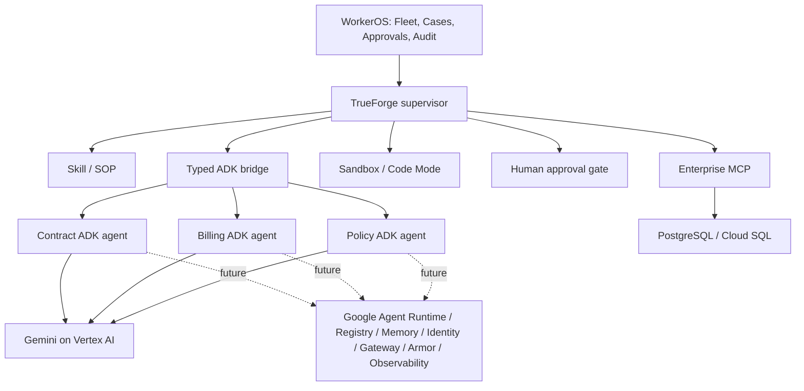

# WorkerOS architecture

WorkerOS is the enterprise business and control plane. TrueForge is the root execution and safety harness. Google ADK supplies institutional specialist agents. PostgreSQL remains the authoritative business-state store; Google enterprise fleet services may add runtime, non-authoritative memory, identity, routing, protection, and telemetry only when genuinely configured.

## Implemented boundaries

- `apps/web` is the Next.js operator surface. Cases, Case Detail, and Approvals can query persisted state; `/fleet` still contains fixture-driven presentation and is not an enterprise registry.
- `packages/contracts` defines shared Zod boundaries. `services/adk-agents` enforces Pydantic request/response boundaries.
- `packages/domain` owns deterministic precedence, dates, arithmetic, and reconciliation. Model output never owns financial arithmetic.
- `packages/policy` is a deny-by-default application tool-policy boundary.
- `services/enterprise-mcp` is the protocol-compliant enterprise-data boundary backed by PostgreSQL through Drizzle.
- `packages/trueforge` creates/reuses sessions, submits turns, and coordinates the persisted golden-path operations. Live sandbox execution, Skill-load evidence, event persistence, and authenticated tenant proof remain absent.
- `packages/operations` owns transactional approval, idempotent mutation, ordered audit events, reread, and verification.

No specialist agent has mutation capability. The web server may authenticate and authorize an approval decision, but the authoritative proposal and write preconditions are loaded server-side. Missing, rejected, expired, unauthorized, malformed, ambiguous, or already-consumed approvals fail closed.

## State ownership

| State                                                                                                        | Owner               | Authority                               |
| ------------------------------------------------------------------------------------------------------------ | ------------------- | --------------------------------------- |
| Commercial evidence, effective state, Cases, proposals, approvals, billing state, verification, audit events | WorkerOS PostgreSQL | Authoritative business state            |
| Active agent execution, turns, approvals, and execution events                                               | TrueForge           | Active execution state when connected   |
| Cross-case organizational context                                                                            | Google Memory Bank  | Non-authoritative only; not implemented |

The complete architecture is a target, not a claim. Current evidence and blockers are maintained in `docs/HACKATHON_SCORECARD.md` and `docs/DEMO_EVIDENCE.md`.
